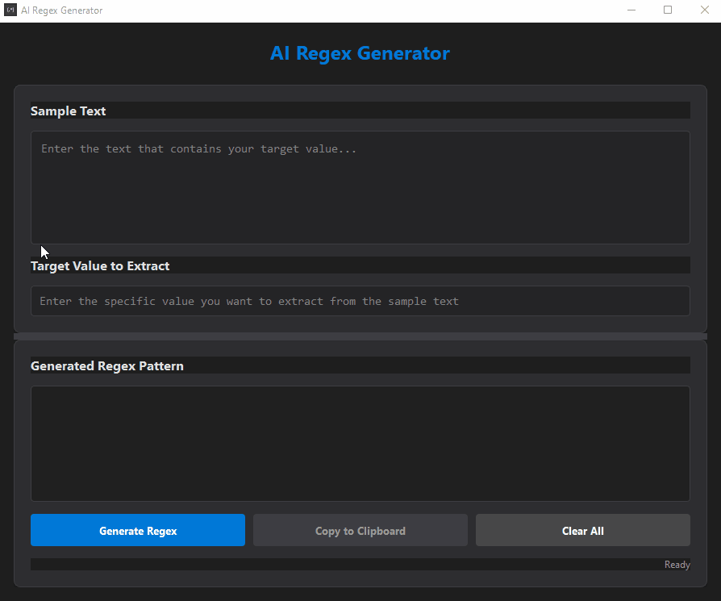

# Regex AI Assistant

A powerful desktop application that uses AI to generate regular expressions based on sample text and target values.



## Features
- 🤖 AI-powered regex pattern generation
- 🎯 Extract specific values from text using natural language
- 💻 Modern, dark-themed user interface
- 📋 One-click copy to clipboard
- 🔒 Secure API key management

## Requirements
- Windows 10/11, macOS 10.15+, or Linux
- GROQ API key (required for AI functionality)

## Installation
1. Download the appropriate file for your platform:
   - Windows: `RegexAIAssistant.exe`
   - macOS: `RegexAIAssistant.app`
   - Linux: `RegexAIAssistant`
2. Run the application
3. Enter your GROQ API key when prompted

## How to Use
1. Enter your sample text in the "Sample Text" field
2. Specify the target value you want to extract
3. Click "Generate Regex" to create the pattern
4. Use "Copy to Clipboard" to copy the generated regex

## Example Use Cases

### 1. Email Address Extraction
```
Sample Text:
Contact us at support@example.com or sales@company.org for assistance.
You can also reach us at info@test.net

Target Value:
support@example.com
```

### 2. Phone Number Extraction
```
Sample Text:
Call us at (555) 123-4567 or +1-555-987-6543
Our support line is 555.888.9999

Target Value:
(555) 123-4567
```

### 3. Date Extraction
```
Sample Text:
The meeting is scheduled for 2024-03-15 and the deadline is 2024/04/20
Please submit by 03-15-2024

Target Value:
2024-03-15
```

### 4. URL Extraction
```
Sample Text:
Visit our website at https://www.example.com/products
Or check https://blog.example.org for updates

Target Value:
https://www.example.com/products
```

### 5. Credit Card Number (Last 4 digits)
```
Sample Text:
Your card ending in 1234 was charged $50.00
Transaction on card ****-****-****-5678 completed

Target Value:
1234
```

## First Run
On first launch, you'll be prompted to enter your GROQ API key. This key is required for the AI functionality and is stored securely in a local .env file.

## Notes
- The application is completely self-contained - no Python installation required
- All dependencies are bundled with the executable
- Your API key is stored locally and never shared

## Development
If you want to build from source:

1. Clone the repository
2. Install dependencies:
   ```bash
   pip install -r requirements.txt
   ```
3. Run the application:
   ```bash
   python app/app.py
   ```

## Building Executables
To build executables for different platforms:

```bash
# Windows
pyinstaller regex_assistant.spec --clean

# macOS
pyinstaller regex_assistant_mac.spec --clean

# Linux
pyinstaller regex_assistant_linux.spec --clean
```

## Support
If you encounter any issues or have questions, please open an issue on the GitHub repository.

## License
This project is licensed under the MIT License - see the LICENSE file for details.

---
*Built with Python, PyQt5, and GROQ AI*

